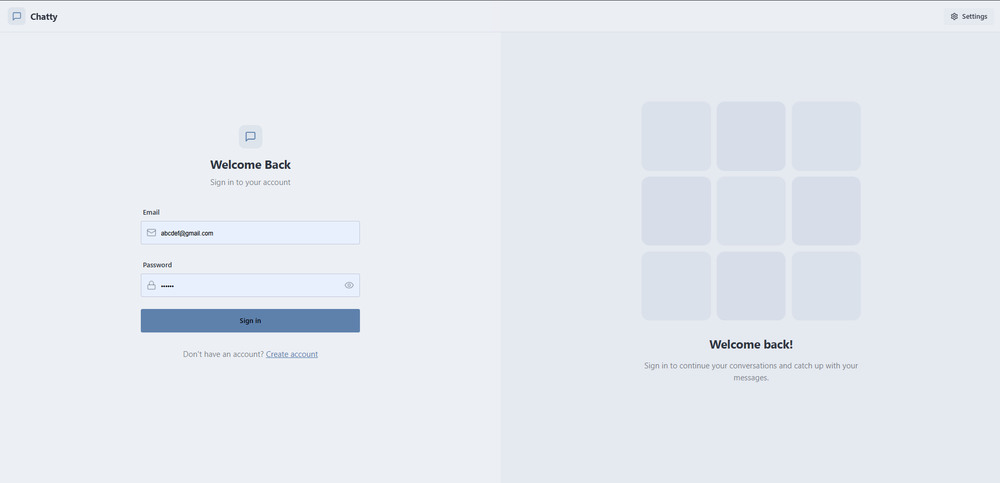
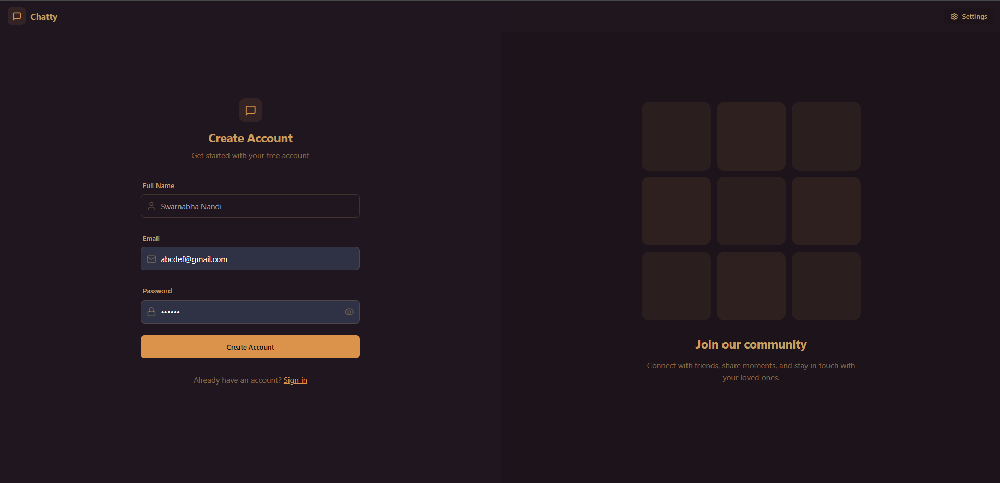
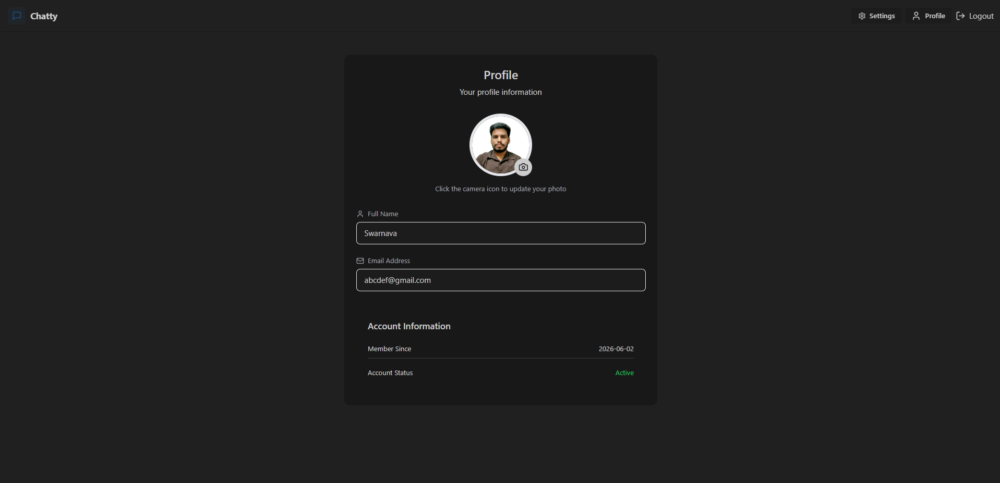
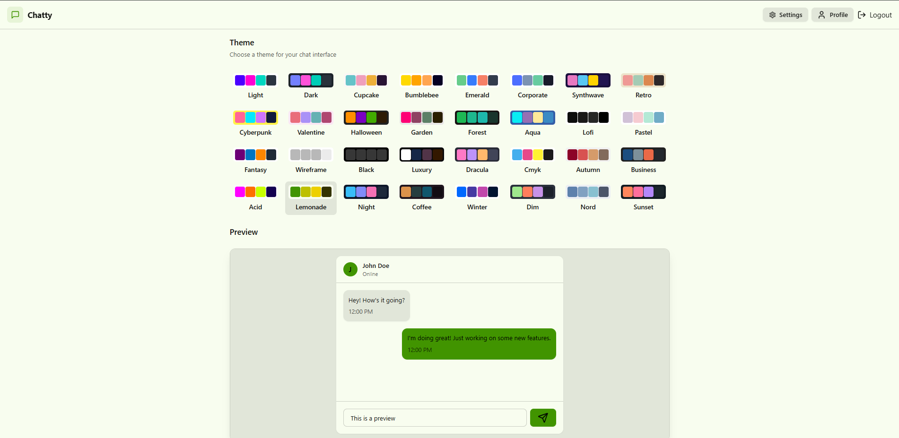

# TalkThru 💬

A scalable real-time chat application built using the MERN stack, Socket.IO, Redis, and Cloudinary.

## 🚀 Demo App
[Live Demo](https://talkthru.onrender.com/)

## 🔥 Highlights:

## Screenshots

### Login Page

### Signup page

### Profile page

### Settings page

## Features

- Secure JWT Authentication & Authorization
- Real-Time Messaging with Socket.IO
- Online / Offline User Presence Tracking
- Last Seen Status Tracking
- Unread Message Counters
- Image Sharing via Cloudinary
- Global State Management using Zustand
- Responsive UI using Tailwind CSS & DaisyUI
- Redis-backed Presence Management
- Socket.IO Redis Adapter for Horizontal Scaling
- Support for 50+ Concurrent Users

---

## Tech Stack

### Frontend
- React.js
- Tailwind CSS
- DaisyUI
- Zustand
- Axios
- Socket.IO Client

### Backend
- Node.js
- Express.js
- MongoDB
- Mongoose
- JWT
- bcryptjs
- Socket.IO

### Infrastructure
- Redis (Upstash)
- Socket.IO Redis Adapter
- Cloudinary
- Render

---

## Architecture

Frontend (React)  //
        │
        ▼
Backend (Node + Express)  //
        │
        ├── MongoDB (User & Message Storage)  //
        │
        ├── Redis //
        │      ├── Online Users//
        │      ├── Last Seen//
        │      └── Unread Counts//
        │
        └── Socket.IO//
               │
               └── Redis Adapter//
                      │
                Multiple Instances//

---

## Scalability Improvements

### Redis Presence System

Stores:

onlineUsers

lastSeen:userId

unread:userId

### Socket.IO Redis Adapter

Enables:

- Multi-server communication
- Shared socket events
- Horizontal scaling
- Distributed real-time messaging

---

## API Endpoints

### Authentication

POST /api/auth/signup

POST /api/auth/login

POST /api/auth/logout

PUT /api/auth/update-profile

GET /api/auth/check

### Messaging

GET /api/messages/users

GET /api/messages/:id

POST /api/messages/send/:id

GET /api/messages/unread

GET /api/messages/unread/:senderId

GET /api/messages/last-seen/:id

---

## Environment Variables

### Backend (.env)

PORT=

MONGODB_URL=

JWT_SECRET=

CLOUDINARY_CLOUD_NAME=

CLOUDINARY_API_KEY=

CLOUDINARY_API_SECRET=

REDIS_URL=

---

## Local Setup

### Backend

npm install

npm run dev

### Frontend

npm install

npm run dev

---

## Future Improvements

- Message Delivery Status (Sent / Delivered / Read)
- Group Chats
- Typing Indicators
- Voice Messages
- Kafka-based Event Streaming
- Push Notifications

---

## Author

Swarnabha Nandi
